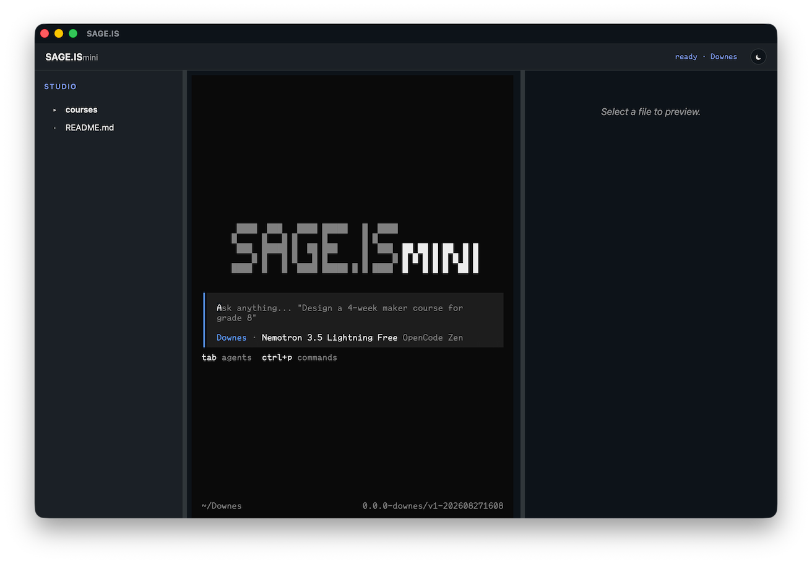

# Downes

Downes is an autonomous education agent. It develops curriculum. Give it a
request: a course, a syllabus, a lesson plan and it turns it into a
structured plan: learning objectives, syllabus, assessments, pacing, resources.
It plans the work, executes it, and checks its own output. It ships as a
self-contained macOS app.

An Apple Silicon Mac with nothing but Homebrew can run it, no Python, no Node, no API key.



## Install

```bash
brew tap sage-is/apps
brew install --cask sage-is/apps/downes
```

Apple Silicon only. Courses live in `~/Downes`; SAGE.IS mini uses
`~/SAGE.ISmini`.

The cask puts Downes in /Applications and links the `downes` command. The
install clears the quarantine flag: the app is ad-hoc signed, not notarized, so
Gatekeeper would otherwise refuse it and you would have to right-click → Open.

It is a deliberate trade-off and we will be notarizating it in the future.

For the bare platform with no curriculum agent bundled, install
[SAGE.IS mini](https://github.com/Sage-is/ai-ui-mini):

```bash
brew install --cask sage-is/apps/mini
```

> Downes is named after Stephen Downes, a Canadian philosopher and commentator in the fields of online learning and new media. He has explored and promoted the educational use of computer and online technologies since 1995.

We built Downes in the spirit of Stephen Downes' connectivism learning theory:
it develops comprehensive curriculum by allowing you to spend more time thinking critically, planning strategically, and learning continuously instead of doing routine production work.

## Using it

Launch Downes and you get our studio window. A terminal pane sits inside the
window and accepts your typing.

Ask for a course — "intro to art techniques grade 9" — and watch the files land.

Files land in `~/Downes/courses/`, or next to it when they are not part of a
course.

Using `downes` from the terminal boots the same engine. The studio and the command are
two entry points to one app. Both pin the workspace to `~/Downes`, isolate
state under `.downes`, and apply the same sandbox.

Uninstall keeps your courses. Add `--zap` to also remove our state. Neither deletes your work.

---
---

## Older Python Architecture

---
---

> **NOTE:** *This is a detailed explanation of our older Python multi-agent architecture that we will be folding into the studio version of Downes. It is here for people who are inclined to explore it or would like to be involved with its development. At the moment it is not part of the Sage.is mini Downes deployment.*

Downes uses a multi-agent architecture with specialized components:

- **Planning Agent**: Analyzes curriculum requests and creates structured development task lists
- **Action Agent**: Selects appropriate instructional design methodologies and executes curriculum development steps
- **Validation Agent**: Verifies task completion and curriculum alignment with learning objectives
- **Answer Agent**: Synthesizes findings into comprehensive curriculum plans

## Project Structure

The repo holds two things: the Python research tool, and the macOS app that
ships to teachers.

```text
AI-Education-Downes/
├── src/downes/                   # the Python research tool
│   ├── agent.py                  # Main agent orchestration logic
│   ├── model.py                  # LLM interface
│   ├── prompts.py                # System prompts for each component
│   ├── schemas.py                # Pydantic models
│   ├── tools/
│   │   ├── education/            # objectives, syllabus, assessments, pacing, taxonomy, resources
│   │   └── search/               # Search and research tools
│   ├── utils/
│   └── cli.py                    # CLI entry point
│
├── launcher/                     # the shipped app
│   ├── downes.sh                 # sole entry point: studio, state isolation, sandbox prefix
│   └── downes.sb                 # Seatbelt profile (see Containment)
├── studio/                       # curriculum template copied to ~/Downes on first run
├── scripts/
│   ├── package_macos.sh          # builds both product payloads from one Rust binary
│   └── install_studio.sh
├── packaging/homebrew/           # formulas published to the sage-is/apps tap
├── test/sandbox/escape-test.sh   # `make sandbox_test`
├── docs/decisions/               # recorded architecture decisions
├── ai-ui-mini/                   # submodule: the MIT platform (engine + studio app)
├── pyproject.toml
└── uv.lock
```


## The Python research tool

The sections from here to [Configuration](#configuration) describe the Python
package the agent grew out of. It is a development and research path — teachers
install the app with `brew` as shown above and need none of it.
[Project Structure](#project-structure) and [Containment](#containment) cover
the whole repo.

### Prerequisites

- Python 3.10 or higher
- [uv](https://github.com/astral-sh/uv) package manager
- LLM API access (one of):
  - **OpenAI API** key (get [here](https://platform.openai.com/api-keys))
  - **OpenRouter** account (get [here](https://openrouter.ai))
  - **Local LLM** via Ollama or llama.cpp (free!)
  - Any OpenAI-compatible API
- **No additional API keys required!** (Core curriculum development functionality included)

### Installation

1. Clone the repository:
```bash
git clone https://github.com/Sage-is/AI-Education-Downes.git
cd AI-Education-Downes
```

2. Install dependencies with uv:
```bash
uv sync
```

3. Set up your environment variables:
```bash
# Copy the example environment file
cp env.example .env

# Edit .env and add your LLM API key
# OPENAI_API_KEY=your-openai-api-key
# That's it! Ready to develop curriculum.
```

#### Usage on Mobile (under development, currently brittle)

##### iOS and iPad

1. install iSH
2. open iSH
3. In the iSH terminal, install git and python `apk add python3 git`
4. Install `apk add py3-pip`

**Note:** Switching away from the iSH terminal for more than a few seconds, may reset the process.

### LLM Configuration

Downes works with **any OpenAI-compatible API**, giving you complete flexibility:


#### Option 1: OpenRouter (Access Multiple Models)

OpenRouter lets you quickly connect to the [latest and greatest models](https://openrouter.ai/rankings?view=trending) from almost any provider. On top of this many AI providers offer [free](https://openrouter.ai/models?max_price=0) use of their AI while they are doing training :D. I wouldn't recommend using the free models for production but they are a great way to get started (so long as security isn't an issue).

```bash
# In your .env file:
OPENAI_API_KEY=sk-or-v1-...
OPENAI_BASE_URL=https://openrouter.ai/api/v1
LLM_MODEL=anthropic/claude-4.5-sonnet
```

#### Option 2: Ollama (100% Free & Local)

For real freedom using Ollama or Llama.cpp They allow you to use any model that your computer has enough ram to run with.

```bash
# 1. Install Ollama from https://ollama.ai
# 2. Pull a model: ollama pull llama3.2
# 3. In your .env file:
OPENAI_BASE_URL=http://localhost:11434/v1
LLM_MODEL=llama3.2
OPENAI_API_KEY=not-needed
```

#### Option 3: llama.cpp (100% Free & Local)
```bash
# 1. Run llama.cpp server with --api-key option
# 2. In your .env file:
OPENAI_BASE_URL=http://localhost:8080/v1
LLM_MODEL=your-model-name
OPENAI_API_KEY=not-needed
```

#### Option 4: OpenAI
```bash
# In your .env file:
OPENAI_API_KEY=sk-...
# Optionally specify model:
# LLM_MODEL=gpt-5.1
```

#### Option 5: Other OpenAI-Compatible APIs
Works with sage.is, Together.ai, Anyscale, or any other OpenAI-compatible endpoint:
```bash
OPENAI_API_KEY=your-api-key
OPENAI_BASE_URL=https://your-provider.com/v1
LLM_MODEL=your-model-name
```

### Optional: SearXNG for Search

You can enable a SearXNG instance for broader education/OER discovery:

```bash
# Example public instance (change as needed)
export SEARXNG_INSTANCE_URL=https://searx.tiekoetter.com
```

The agent exposes a `searx_search` tool that queries your instance with an education bias by default (curriculum, syllabus, lesson plan, rubric, OER).

### Make sure to source the .env vars

```
source .env
```

### Usage

Run Downes in interactive mode:
```bash
uv run downes-agent
```

When prompted, enter a curriculum request. For example:

```text
>> intro to art techniques grade 9
```

Downes will plan tasks (objectives, syllabus, assessments, pacing, resources), execute tools, and produce a structured curriculum plan.

### Example Queries

Try asking Downes to develop curriculum like:
- "Create a 12-week introduction to Python programming course for beginners"
- "Design a curriculum for teaching machine learning fundamentals to business students"
- "Develop a workshop series on data visualization and storytelling"
- "Build a comprehensive bootcamp curriculum for web development"

Downes will automatically:

1. Break down your request into curriculum development tasks
2. Define clear learning objectives and outcomes
3. Structure modules, lessons, and assessments
4. Provide a comprehensive, pedagogically-sound curriculum plan

### Debug and Development Modes

Downes includes powerful debugging and development features:

#### Interactive Debug Mode ✨ NEW!
Review and edit every AI prompt before submission:

```bash
# Enable interactive debug mode
uv run downes-agent --debug "Create a Python course"
uv run downes-agent -d "Design a curriculum"
```

In debug mode, before each LLM call you can:
- **[s]** Submit the prompt as-is
- **[e]** Edit the user prompt in your editor
- **[E]** Edit the system prompt in your editor
- **[v]** View full, untruncated prompts
- **[c]** Cancel and skip this LLM call

Perfect for:
- 🔍 Understanding how the agent works
- ✏️ Experimenting with prompt engineering
- 🐛 Debugging unexpected behavior
- 💰 Controlling API costs
- 📚 Learning AI agent patterns

#### Verbose Mode
See timing and token usage:

```bash
# Enable verbose mode
uv run downes-agent --verbose "Create a course"
uv run downes-agent -v "Design a module"

# Combine verbose with debug
uv run downes-agent -v -d "Build curriculum"
```

**Documentation:**
- [Interactive Debug Mode Guide](docs/INTERACTIVE_DEBUG_MODE.md) - Full interactive features documentation
- [Interactive Quick Reference](docs/INTERACTIVE_QUICK_REFERENCE.md) - Quick command reference
- [Verbose & Debug Modes](docs/VERBOSE_DEBUG_MODES.md) - All debugging features

### Programmatic Usage

You can call the education tools directly in Python — the modules live under
`src/downes/tools/education/`.

## Configuration

Downes supports configuration via the `Agent` class initialization:

```python
from downes.agent import Agent

agent = Agent(
    max_steps=20,              # Global safety limit
    max_steps_per_task=5       # Per-task iteration limit
)
```

## How to Contribute

1. Fork the repository
2. Create a feature branch
3. Commit your changes
4. Push to the branch
5. Create a Pull Request

**Important**: Please keep your pull requests small and focused.  This will make it easier to review and merge.


## License

This project is licensed under the AGPL License.