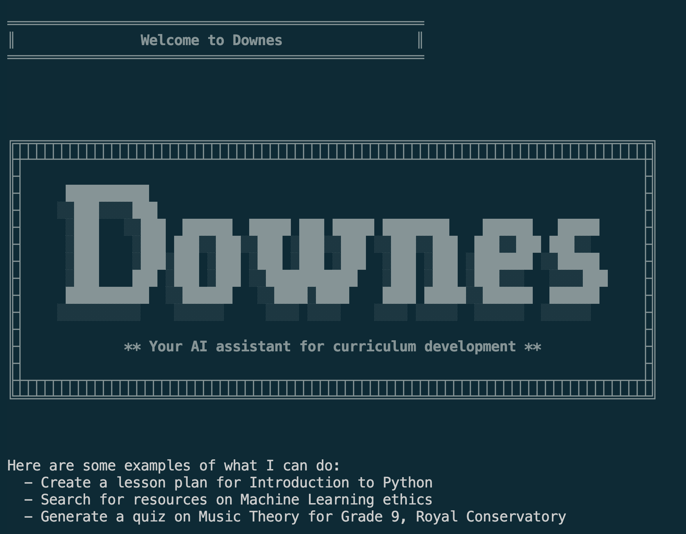

# Downes 🤖

## Version v0.1.0



> Downes is named after Stephen Downes, a Canadian philosopher and commentator in the fields of online learning and new media. He has explored and promoted the educational use of computer and online technologies since 1995. 

In this spirit, Downes is an autonomous education agent designed to develop comprehensive curriculum by thinking critically, planning strategically, and learning continuously.

Built specifically for curriculum development, Downes transforms complex educational requests into transparent, step-by-step curriculum plans—emulating how an expert instructional designer works, but powered by advanced AI. It merges task planning, self-reflection, and educational best practices into a seamless workflow. It is more than an assistant—it is a self-driven curriculum architect that aims to bring clarity and structure to educational program development.

100% FREE to use! No paid API keys needed for core functionality—Downes leverages powerful AI capabilities to make curriculum development accessible to all educators and instructional designers.


## Overview

Downes takes complex curriculum requests and turns them into clear, step-by-step educational development plans. It structures learning objectives, designs course content, and creates comprehensive curricula that are pedagogically sound and learner-focused.

**Key Capabilities:**
- **Intelligent Curriculum Planning**: Automatically decomposes educational goals into structured learning pathways
- **Autonomous Development**: Selects and applies appropriate instructional design methodologies
- **Self-Validation**: Checks alignment with learning objectives and iterates until curricula are complete
- **Educational Best Practices**: Incorporates proven pedagogical frameworks and assessment strategies
- **Flexible LLM Support**: Works with OpenAI, OpenRouter, Ollama, llama.cpp, or any OpenAI-compatible API
- **Safety Features**: Built-in loop detection and step limits to prevent runaway execution

[](https://twitter.com/Sage_Is_AI)

### Prerequisites

- Python 3.10 or higher
- [uv](https://github.com/astral-sh/uv) package manager
- LLM API access (one of):
  - **OpenAI API** key (get [here](https://platform.openai.com/api-keys))
  - **OpenRouter** account (get [here](https://openrouter.ai))
  - **Local LLM** via Ollama or llama.cpp (free!)
  - Any OpenAI-compatible API
- **No additional API keys required!** (Core curriculum development functionality included)

### Installation

1. Clone the repository:
```bash
git clone https://github.com/Sage-is/AI-Education-Downes.git
cd downes
```

2. Install dependencies with uv:
```bash
uv sync
```

3. Set up your environment variables:
```bash
# Copy the example environment file
cp env.example .env

# Edit .env and add your LLM API key
# OPENAI_API_KEY=your-openai-api-key
# That's it! Ready to develop curriculum.
```

### LLM Configuration

Downes works with **any OpenAI-compatible API**, giving you complete flexibility:


#### Option 1: OpenRouter (Access Multiple Models)

OpenRouter lets you quickly connect to the [latest and greatest models](https://openrouter.ai/rankings?view=trending) from almost any provider. On top of this many AI providers offer [free](https://openrouter.ai/models?max_price=0) use of thier AI while they are doing training :D. I wouldn't recomend using the free models for production but they are a great way to get started (so long as security isn't an issue).

```bash
# In your .env file:
OPENAI_API_KEY=sk-or-v1-...
OPENAI_BASE_URL=https://openrouter.ai/api/v1
LLM_MODEL=anthropic/claude-4.5-sonnet
```

#### Option 2: Ollama (100% Free & Local)

For real freedom using Ollama or Llama.cpp They allow you to use any model that your computer has enough ram to run with.

```bash
# 1. Install Ollama from https://ollama.ai
# 2. Pull a model: ollama pull llama3.2
# 3. In your .env file:
OPENAI_BASE_URL=http://localhost:11434/v1
LLM_MODEL=llama3.2
OPENAI_API_KEY=not-needed
```

#### Option 3: llama.cpp (100% Free & Local)
```bash
# 1. Run llama.cpp server with --api-key option
# 2. In your .env file:
OPENAI_BASE_URL=http://localhost:8080/v1
LLM_MODEL=your-model-name
OPENAI_API_KEY=not-needed
```

#### Option 4: OpenAI
```bash
# In your .env file:
OPENAI_API_KEY=sk-...
# Optionally specify model:
# LLM_MODEL=gpt-5.1
```

#### Option 5: Other OpenAI-Compatible APIs
Works with sage.is, Together.ai, Anyscale, or any other OpenAI-compatible endpoint:
```bash
OPENAI_API_KEY=your-api-key
OPENAI_BASE_URL=https://your-provider.com/v1
LLM_MODEL=your-model-name
```

### Optional: SearXNG for Search

You can enable a SearXNG instance for broader education/OER discovery:

```bash
# Example public instance (change as needed)
export SEARXNG_INSTANCE_URL=https://searx.tiekoetter.com
```

The agent exposes a `searx_search` tool that queries your instance with an education bias by default (curriculum, syllabus, lesson plan, rubric, OER).

### Usage

Run Downes in interactive mode:
```bash
uv run downes-agent
```

When prompted, enter a curriculum request. For example:

```text
>> intro to art techniques grade 9
```

Downes will plan tasks (objectives, syllabus, assessments, pacing, resources), execute tools, and produce a structured curriculum plan.

### Example Queries

Try asking Downes to develop curriculum like:
- "Create a 12-week introduction to Python programming course for beginners"
- "Design a curriculum for teaching machine learning fundamentals to business students"
- "Develop a workshop series on data visualization and storytelling"
- "Build a comprehensive bootcamp curriculum for web development"

Downes will automatically:

1. Break down your request into curriculum development tasks
2. Define clear learning objectives and outcomes
3. Structure modules, lessons, and assessments
4. Provide a comprehensive, pedagogically-sound curriculum plan

### Debug and Development Modes

Downes includes powerful debugging and development features:

#### Interactive Debug Mode ✨ NEW!
Review and edit every AI prompt before submission:

```bash
# Enable interactive debug mode
uv run downes-agent --debug "Create a Python course"
uv run downes-agent -d "Design a curriculum"
```

In debug mode, before each LLM call you can:
- **[s]** Submit the prompt as-is
- **[e]** Edit the user prompt in your editor
- **[E]** Edit the system prompt in your editor
- **[v]** View full, untruncated prompts
- **[c]** Cancel and skip this LLM call

Perfect for:
- 🔍 Understanding how the agent works
- ✏️ Experimenting with prompt engineering
- 🐛 Debugging unexpected behavior
- 💰 Controlling API costs
- 📚 Learning AI agent patterns

#### Verbose Mode
See timing and token usage:

```bash
# Enable verbose mode
uv run downes-agent --verbose "Create a course"
uv run downes-agent -v "Design a module"

# Combine verbose with debug
uv run downes-agent -v -d "Build curriculum"
```

**Documentation:**
- [Interactive Debug Mode Guide](docs/INTERACTIVE_DEBUG_MODE.md) - Full interactive features documentation
- [Interactive Quick Reference](docs/INTERACTIVE_QUICK_REFERENCE.md) - Quick command reference
- [Verbose & Debug Modes](docs/VERBOSE_DEBUG_MODES.md) - All debugging features

### Programmatic Usage

You can also call the education tools directly in Python to build custom flows:

```python
from downes.tools.education.objectives import generate_learning_objectives
from downes.tools.education.syllabus import draft_syllabus
from downes.tools.education.assessments import design_assessments
from downes.tools.education.pacing import create_pacing_guide
from downes.tools.education.taxonomy import map_to_blooms_taxonomy
from downes.tools.education.resources import curate_learning_resources

topic = "Intro to Art Techniques"
audience = "Grade 9 students"

# 1) Objectives
objectives = generate_learning_objectives.run({
  "topic": topic,
  "audience": audience,
  "level": "beginner",
  "duration_weeks": 10,
  "outcomes_count": 5,
})

# 2) Syllabus aligned to objectives
syllabus = draft_syllabus.run({
  "course_title": topic,
  "learning_objectives": objectives,
  "duration_weeks": 10,
  "modality": "in-person",
  "modules_count": 5,
})

# 3) Assessments + rubrics
assessments = design_assessments.run({
  "learning_objectives": objectives,
  "assessment_types": ["quiz", "project", "presentation"],
})

# 4) Pacing guide
pacing = create_pacing_guide.run({
  "duration_weeks": 10,
  "modules_count": 5,
  "hours_per_week": 4,
})

# 5) Bloom's taxonomy mapping
taxonomy = map_to_blooms_taxonomy.run({
  "learning_objectives": objectives
})

# 6) Curated resources
resources = curate_learning_resources.run({
  "topic": topic,
  "resource_types": ["article", "video"],
  "max_items": 6,
})

print(len(objectives), "objectives")
print(len(syllabus["modules"]), "modules in syllabus")
print(len(assessments), "assessments")
print(len(pacing), "weeks in pacing guide")
print(len(taxonomy), "taxonomy mappings")
print(len(resources), "resources")
```

## Architecture

Downes uses a multi-agent architecture with specialized components:

- **Planning Agent**: Analyzes curriculum requests and creates structured development task lists
- **Action Agent**: Selects appropriate instructional design methodologies and executes curriculum development steps
- **Validation Agent**: Verifies task completion and curriculum alignment with learning objectives
- **Answer Agent**: Synthesizes findings into comprehensive curriculum plans

## Project Structure

```text
downes/
├── src/
│   ├── downes/
│   │   ├── agent.py              # Main agent orchestration logic
│   │   ├── model.py              # LLM interface
│   │   ├── prompts.py            # System prompts for each component
│   │   ├── schemas.py            # Pydantic models
│   │   ├── tools/
│   │   │   ├── education/        # Curriculum tools (objectives, syllabus, assessments, pacing, taxonomy, resources)
│   │   │   ├── search/           # Search and research tools
│   │   │   └── ...               # Additional curriculum development tools
│   │   ├── utils/                # Utility functions
│   │   └── cli.py                # CLI entry point
├── pyproject.toml
└── uv.lock
```

## Configuration

Downes supports configuration via the `Agent` class initialization:

```python
from downes.agent import Agent

agent = Agent(
    max_steps=20,              # Global safety limit
    max_steps_per_task=5       # Per-task iteration limit
)
```

## How to Contribute

1. Fork the repository
2. Create a feature branch
3. Commit your changes
4. Push to the branch
5. Create a Pull Request

**Important**: Please keep your pull requests small and focused.  This will make it easier to review and merge.


## License

This project is licensed under the AGPL License.

